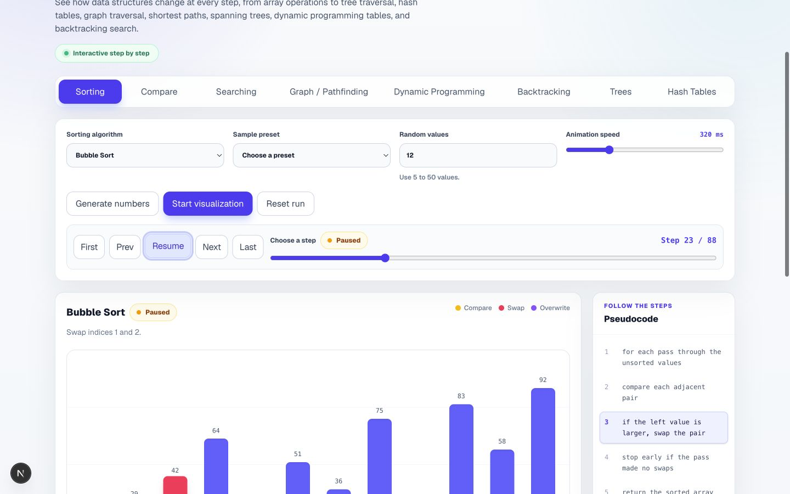
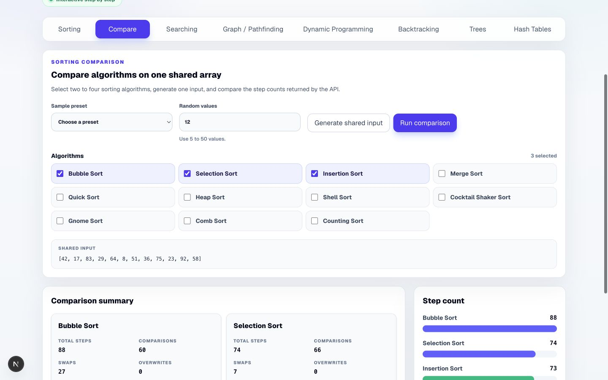
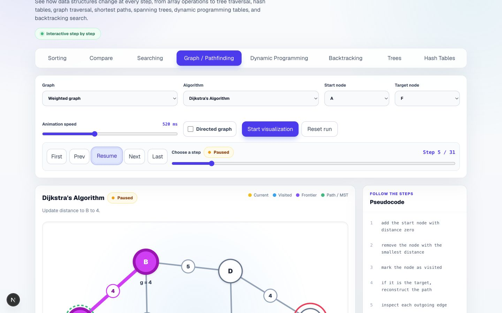
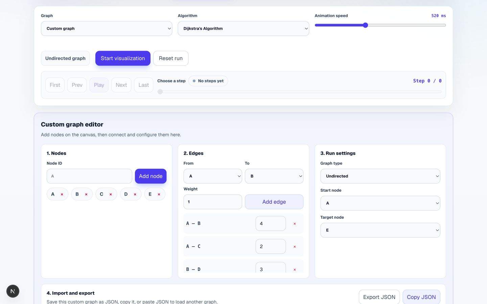
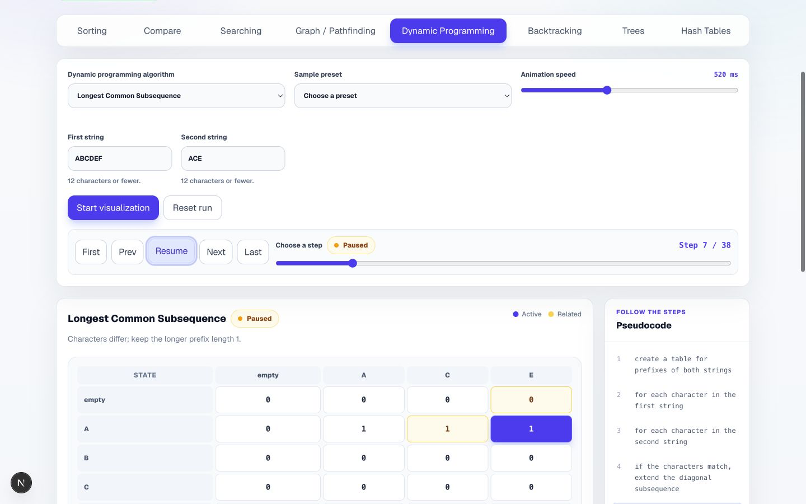
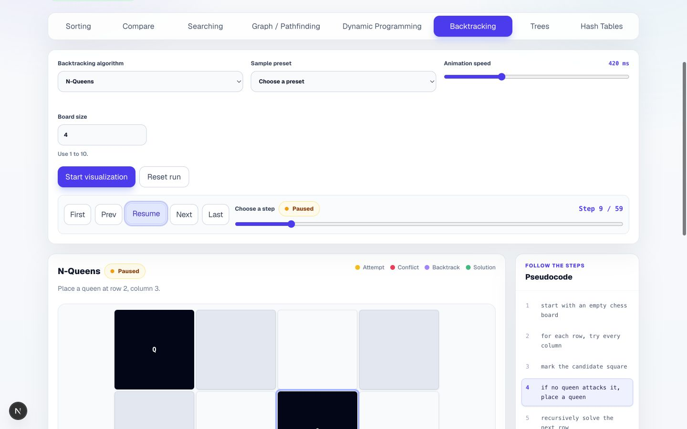

# Algorithm Visualizer

An interactive educational application for understanding algorithms through step-by-step visualization. Instead of only seeing the final answer, you can follow each comparison, traversal, table update, recursive choice, and data-structure change as it happens.



## Overview

Algorithm Visualizer pairs a FastAPI backend with a Next.js frontend. The backend turns an algorithm run into an ordered series of execution states; the frontend animates those states alongside the matching pseudocode, explanation, complexity information, and live run details.

The project spans arrays, hash tables, trees, graphs, dynamic programming, and backtracking, making it both a learning tool and a full-stack portfolio project.

## Features

- Follow an algorithm automatically or move one step at a time with play, pause, previous, next, first, last, restart, reset, seek, and speed controls.
- See the active pseudocode line, current operation, progress, elapsed time, result, and algorithm-specific state together.
- Review descriptions, best/average/worst time complexity, space complexity, and implementation notes for every algorithm.
- Start quickly with curated examples, generate random arrays, or enter problem-specific values manually.
- Compare two to four sorting algorithms on the same input using step, comparison, swap, overwrite, and average-complexity metrics.
- Explore graph traversals, shortest paths, topological ordering, and minimum spanning trees on weighted presets or a custom graph.
- Build custom directed or undirected graphs, edit edge weights, choose endpoints, and import, copy, or export graph JSON.
- Watch dedicated array, table, grid, chessboard, tree, graph, hash-bucket, and probing visualizations rather than a one-size-fits-all animation.

## Supported Algorithms

The metadata catalog and API currently expose 41 algorithms across seven categories.

| Category | Algorithms |
| --- | --- |
| Sorting | Bubble Sort, Selection Sort, Insertion Sort, Merge Sort, Quick Sort, Heap Sort, Shell Sort, Cocktail Shaker Sort, Gnome Sort, Comb Sort, Counting Sort |
| Searching | Linear Search, Binary Search |
| Hash Tables | Insert — Separate Chaining, Search — Separate Chaining, Insert — Linear Probing, Search — Linear Probing |
| Trees | BST Insert, AVL Tree Insert, BST Search, Inorder Traversal, Preorder Traversal, Postorder Traversal |
| Graph / Pathfinding | Breadth-First Search, Depth-First Search, Dijkstra's Algorithm, A* Search, Topological Sort, Kruskal's Minimum Spanning Tree, Prim's Minimum Spanning Tree |
| Dynamic Programming | Fibonacci DP, Coin Change, 0/1 Knapsack, Longest Common Subsequence, Edit Distance, Grid Unique Paths |
| Backtracking | N-Queens, Maze Solver, Permutations, Subsets, Sudoku Solver |

Binary Search uses an ascending array. Dijkstra and A* require non-negative weights, Topological Sort runs on a directed graph, and the minimum-spanning-tree algorithms run on an undirected graph. The interface applies or explains these constraints when you switch algorithms.

## Showcase

### Compare sorting algorithms

Run multiple algorithms against one shared array and compare the work each one performs.



### Explore weighted graphs

Follow Dijkstra's distance updates while the active frontier, edge weights, path costs, and pseudocode remain visible.



### Build a custom graph

Create nodes and edges, edit weights and run settings, then share the graph through JSON import and export.



### Inspect dynamic programming tables

See the active cell and its dependencies as a table is filled from smaller subproblems.



### Follow backtracking decisions

Watch recursive choices, conflicts, removals, and solutions on visual problem state such as an N-Queens board.



## How It Works

```text
Algorithm + input selected in the browser
                    ↓
             Next.js frontend
                    ↓ HTTP
              FastAPI backend
                    ↓
        Ordered execution-state snapshots
                    ↓
Visualization + pseudocode + run details
```

The frontend owns input controls, presets, playback, and the specialized visual components. The backend validates requests, executes the selected algorithm, and returns snapshots with descriptions and, where applicable, a 1-based pseudocode line. The frontend uses those snapshots as a timeline that can be played or inspected in either direction.

The sorting comparison mode requests the same input for each selected algorithm and summarizes their returned steps. Graph presets and custom-graph editing live in the frontend; graph execution and validation remain in the backend.

## Tech Stack

| Area | Technologies |
| --- | --- |
| Frontend | Next.js, React, TypeScript, Tailwind CSS |
| Backend | Python, FastAPI, Pydantic, Uvicorn |
| Quality | pytest, Ruff, ESLint, Next.js production builds |
| Tooling | uv, npm, Python development script, GitHub Actions |

## Local Development

### Prerequisites

- Python 3.12 or newer
- [uv](https://docs.astral.sh/uv/)
- Node.js with npm (CI currently uses Node.js 22)

From the repository root, install the locked backend and frontend dependencies:

```bash
python scripts/dev.py setup
```

Run the two development servers in separate terminals:

```bash
# Terminal 1 — FastAPI
python scripts/dev.py backend
```

```bash
# Terminal 2 — Next.js
python scripts/dev.py frontend
```

Open the services at:

- Application: `http://localhost:3000`
- Backend: `http://127.0.0.1:8000`
- Interactive API docs: `http://127.0.0.1:8000/docs`

If your system exposes Python as `python3`, replace `python` in the commands above:

```bash
python3 scripts/dev.py setup
python3 scripts/dev.py backend
python3 scripts/dev.py frontend
```

<details>
<summary>Run each project manually</summary>

```bash
cd backend
uv run uvicorn app.main:app --reload
```

```bash
cd frontend
npm run dev
```

</details>

## Validation

Validate with the dependencies already installed:

```bash
python scripts/dev.py check
```

This runs Ruff and pytest for the backend, then ESLint and a production build for the frontend. To synchronize both projects from their lockfiles before running the same checks, use:

```bash
python scripts/dev.py check-clean
```

CI runs Ruff and pytest for the backend plus a production frontend build on pushes and pull requests to `master`; the local `check` command additionally runs ESLint.

## API

The FastAPI service exposes the algorithm metadata catalog, random-number generation, and one step-generation endpoint for each visualization family:

- `GET /algorithms`
- `POST /numbers/random`
- `POST /sorting/steps`
- `POST /searching/steps`
- `POST /hash-tables/steps`
- `POST /trees/steps`
- `POST /graph/steps`
- `POST /dynamic-programming/steps`
- `POST /backtracking/steps`

Use the interactive OpenAPI interface at `http://127.0.0.1:8000/docs` while the backend is running. Request examples and response conventions are documented in [docs/api.md](docs/api.md).

## Project Structure

```text
algorithm-visualizer/
├── backend/          # FastAPI app, algorithm implementations, and tests
├── frontend/         # Next.js interface and visualization components
├── docs/             # Supporting documentation and showcase images
├── scripts/          # Cross-project development workflow
├── .github/          # Continuous integration configuration
└── README.md
```

## Documentation

- [API guide and request examples](docs/api.md)
- [UX/UI audit](docs/ux-ui-audit.md)

## About

Algorithm Visualizer is an open-source learning and portfolio project focused on making algorithm execution observable, explorable, and easier to reason about. Contributions and issue reports are welcome through the GitHub repository.
